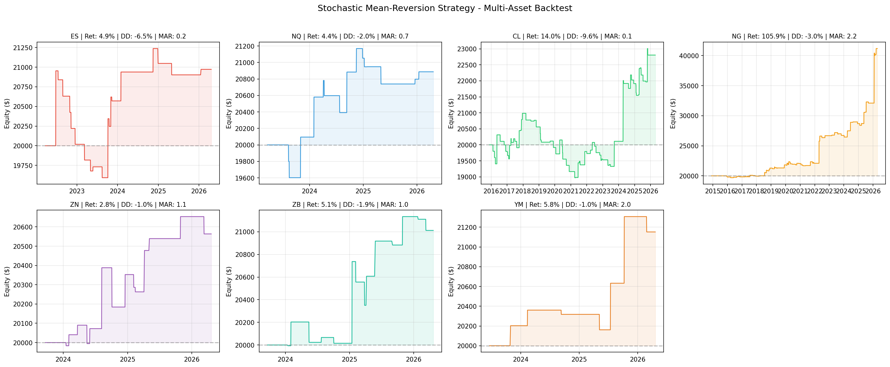
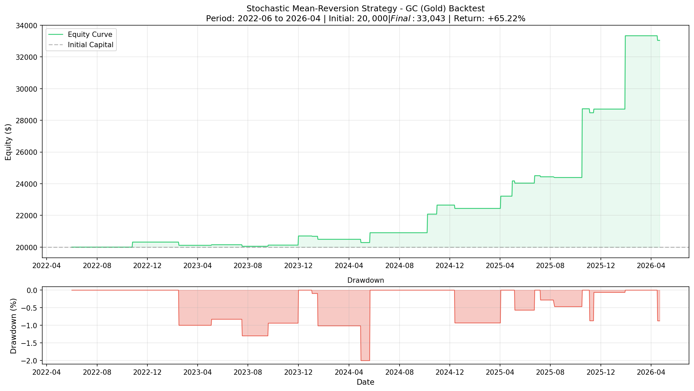

# Stochastic Mean-Reversion Strategy (随机均值回归策略)

## 1. 策略概述

基于随机指标（Stochastic Oscillator）的均值回归策略，核心思想是在趋势方向上的超卖/超买区域寻找反转机会。

**来源**: Substack 文章 "The Stochastic Mean-Reversion Strategy" by Quantified Strategies

---

## 2. 核心规则

### 2.1 入场条件

| 方向 | 条件 |
|------|------|
| **做多 (Long)** | 1. %K < 30（超卖区） 2. %K 上穿 %D（金叉） 3. 收盘价 > 50日均线（趋势向上） |
| **做空 (Short)** | 1. %K > 80（超买区） 2. %K 下穿 %D（死叉） 3. 收盘价 < 50日均线（趋势向下） |

### 2.2 出场条件

| 类型 | 规则 |
|------|------|
| **固定止损** | 入场价 ± 1.5% |
| **移动止盈** | ATR(14) × 2.0  trailing stop |

### 2.3 参数设置

| 参数 | 值 | 说明 |
|------|-----|------|
| Stochastic K | 14 | 计算周期 |
| Stochastic D | 3 | %D 平滑周期 |
| Stochastic Smooth | 3 | %K 平滑周期 |
| 超卖阈值 | 30 | 做多触发区 |
| 超买阈值 | 80 | 做空触发区 |
| ATR 周期 | 14 | 波动率计算 |
| 趋势均线 | 50 | 趋势过滤器 |
| 固定止损 | 1.5% | 硬止损 |
| 移动止盈 ATR 倍数 | 2.0 | 动态止盈 |
| 单笔风险 | 1% | 仓位管理 |

---

## 3. 回测结果

### 3.1 测试标的
- **品种**: GC (Gold Futures) - COMEX 黄金期货
- **周期**: 日线 (1D)
- **数据区间**: 2022-06 至 2026-04
- **初始资金**: $20,000

### 3.2 绩效指标

| 品种 | 总收益率 | CAGR | 最大回撤 | MAR | 交易次数 | 胜率 | 盈亏比 |
|------|---------|------|---------|-----|---------|------|--------|
| **GC (黄金)** | **+65.22%** | **13.78%** | **-2.00%** | **6.87** | 24 | 54.17% | 8.59 |
| **NG (天然气)** | **+105.89%** | **6.54%** | **-2.95%** | **2.22** | 75 | 48.00% | 5.34 |
| **CL (原油)** | +14.03% | 1.27% | -9.59% | 0.13 | 72 | 36.11% | 1.41 |
| **YM (道指)** | +5.76% | 1.99% | -0.98% | 2.04 | 7 | 57.14% | 4.25 |
| **ZB (长期国债)** | +5.06% | 1.93% | -1.86% | 1.03 | 14 | 42.86% | 2.30 |
| **ES (标普)** | +4.86% | 1.17% | -6.49% | 0.18 | 19 | 36.84% | 1.51 |
| **NQ (纳斯达克)** | +4.44% | 1.41% | -2.03% | 0.70 | 15 | 53.33% | 1.73 |
| **ZN (10年期国债)** | +2.82% | 1.08% | -1.00% | 1.08 | 14 | 57.14% | 2.14 |

> **结论**: 策略在 **GC（黄金）** 和 **NG（天然气）** 上表现最佳，MAR > 2。股指（ES/NQ）和原油（CL）表现一般，可能因趋势性强、均值回归特征弱。国债（ZN/ZB）表现平稳但收益有限。

### 3.3 权益曲线对比

> 上图：各品种权益曲线对比。GC 和 NG 呈现明显的阶梯式上升，其他品种则较为平缓。

### 3.4 GC 单品种权益曲线

> GC 单品种详细权益曲线。绿色曲线为权益曲线，红色区域为回撤。策略在约4年时间内实现稳健增长，回撤控制极为出色（最大仅2%）。

---

## 4. 策略特点分析

### 4.1 优势
- ✅ **回撤极低**: 最大回撤仅2%，风险可控
- ✅ **盈亏比高**: 8.59，盈利单笔远大于亏损单笔
- ✅ **MAR优秀**: 6.87，收益/风险比出色
- ✅ **趋势过滤**: 50日均线过滤避免逆势交易

### 4.2 劣势与风险
- ⚠️ **交易频率低**: 4年仅24笔，样本量偏小
- ⚠️ **依赖趋势环境**: 震荡市可能频繁止损
- ⚠️ **参数敏感**: Stochastic阈值（30/80）和ATR倍数需适配品种
- ⚠️ **未考虑滑点/佣金**: 回测为理想条件，实盘需额外成本缓冲

### 4.3 适用场景
- 趋势明确的商品期货（黄金、原油等）
- 中等波动率环境
- 日线级别波段交易

---

## 5. 改进方向

| 方向 | 思路 |
|------|------|
| **多品种测试** | 扩展至 CL、NG、ES 等期货 |
| **参数优化** | 对 Stochastic阈值、ATR倍数进行 walk-forward 优化 |
| **仓位动态** | 根据波动率调整仓位（Volatility Targeting） |
| **组合配置** | 与趋势策略组合，降低整体回撤 |

---

## 6. 相关文件

| 文件 | 路径 |
|------|------|
| 权益曲线数据 | `/root/.openclaw/workspace/cta_developer/stoch_gold_equity.csv` |
| 权益曲线图表 | `/root/.openclaw/workspace/cta_developer/stoch_gold_equity.png` |
| 回测脚本 | `/root/.openclaw/workspace/cta_developer/save_equity.py` |

---

## 7. 标签

#strategy #mean-reversion #stochastic #gold #futures #backtest #cta #momentum

---

*Created: 2026-04-24*
